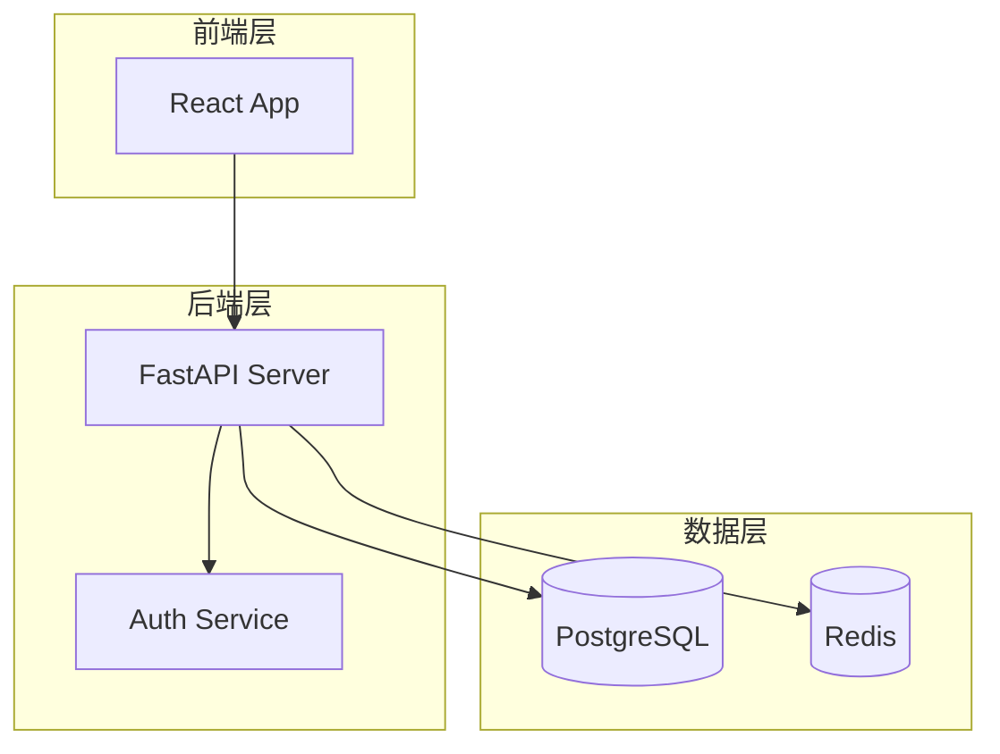

# Code Diagram Analyst

分析项目代码，自动识别并生成适合该项目的各类软件工程图表。

---

## 工作流程

### Step 1：读取与理解代码

**如果用户上传了文件**，先查看 `/mnt/user-data/uploads/` 目录：
```bash
ls /mnt/user-data/uploads/
```

根据文件类型选择读取策略：
- **zip/tar 压缩包** → 解压到 `/tmp/project/` 后分析
- **单个代码文件** → 直接读取
- **多个文件** → 批量读取，优先入口文件、配置文件、核心模块

解压示例：
```bash
mkdir -p /tmp/project
cd /tmp/project
unzip -q /mnt/user-data/uploads/xxx.zip
# 或
tar -xf /mnt/user-data/uploads/xxx.tar.gz
```

**快速结构扫描**（了解项目全貌）：
```bash
# 目录树（排除依赖目录）
find /tmp/project -type f \( -name "*.py" -o -name "*.js" -o -name "*.ts" -o -name "*.java" -o -name "*.go" -o -name "*.cs" \) \
  | grep -v node_modules | grep -v __pycache__ | grep -v ".git" | head -80

# 统计文件数量和语言分布
find /tmp/project -type f | grep -v node_modules | grep -v .git \
  | sed 's/.*\.//' | sort | uniq -c | sort -rn | head -20
```

---

### Step 2：识别可生成的图表类型

根据代码内容，判断哪些图表有意义，**从下表中选择适合的图表**：

| 图表类型 | 触发条件 | Mermaid 语法 |
|---------|---------|-------------|
| **类图 (Class Diagram)** | 有类定义、继承、接口 | `classDiagram` |
| **ER 图 (Entity Relationship)** | 有数据库模型、ORM、schema | `erDiagram` |
| **序列图 (Sequence Diagram)** | 有API调用、消息传递、请求响应流程 | `sequenceDiagram` |
| **架构图 (Architecture)** | 有多个服务/模块/层次结构 | `graph TD` / `C4Context` |
| **组件图 (Component Diagram)** | 有模块间依赖关系 | `graph LR` |
| **流程图 (Flowchart)** | 有业务逻辑、状态机、处理流程 | `flowchart TD` |
| **状态图 (State Diagram)** | 有状态枚举、状态转换逻辑 | `stateDiagram-v2` |
| **依赖图 (Dependency Graph)** | 有包依赖、模块引用 | `graph LR` |
| **数据流图 (Data Flow)** | 有数据处理管道、ETL流程 | `flowchart LR` |
| **时序图 (Timeline)** | 有版本历史、里程碑 | `timeline` |

**选择原则**：
- 优先生成最能体现项目核心结构的图表（通常是架构图 + 类图/ER图）
- 对小项目生成 2-3 张图，对大项目生成 3-5 张图
- 每张图聚焦一个主题，避免信息过载（单图节点不超过 20 个）

---

### Step 3：分析代码细节

针对每类要生成的图表，深入阅读相关代码：

**类图分析**：
- 找所有 class 定义，记录属性、方法（关键的，非全部）
- 识别继承 (`extends`/`implements`/`class A(B)`)
- 识别组合/聚合关系（一个类持有另一个类的实例）

**ER 图分析**：
- 找 Model/Entity/Schema 定义
- 识别字段类型、主键、外键
- 识别表间关系（一对一、一对多、多对多）

**架构图分析**：
- 识别分层：前端、后端、数据库、缓存、消息队列、外部服务
- 识别微服务边界（多个独立服务）
- 找配置文件（docker-compose.yml、k8s yaml）了解部署结构

**序列图分析**：
- 找核心业务流程（用户登录、下单、支付等）
- 追踪 API 调用链路

---

### Step 4：生成 Mermaid 图表

**输出格式规范**：

每张图表输出一个独立的 Mermaid 代码块，并附上中文标题和简短说明：

````markdown
## 📐 系统架构图

> 描述系统整体分层结构和各组件之间的关系。


````

**Mermaid 质量要点**：
- 节点 ID 只用英文字母数字下划线（无空格）
- 节点标签可用中文，用 `["中文名称"]` 包裹
- 使用 `subgraph` 分组相关节点
- 关系标注要简洁（`-->|调用|`、`-->|继承|`）
- 复杂图拆分为多张而非塞进一张

**各图表 Mermaid 模板** → 详见 `references/mermaid-templates.md`

---

### Step 5：输出结构

按以下结构组织输出：

```
# 📊 [项目名称] 软件工程图表分析

## 项目概览
（2-3句话描述项目是什么、用什么技术栈、核心功能）

## 生成的图表

### 1. [图表类型]（如：系统架构图）
> 简短说明
[Mermaid代码块]

### 2. [图表类型]
...

## 图表说明
（对关键设计决策或复杂关系的补充解释）
```

---

## 注意事项

- **大型项目**：只分析核心模块，不必覆盖所有文件
- **动态语言**（Python/JS）：类关系可能通过 duck typing 实现，需结合运行逻辑推断
- **配置即架构**：`docker-compose.yml`、`nginx.conf`、`k8s/*.yaml` 往往比代码更能反映部署架构
- **数据库 migration 文件**：是生成 ER 图的最可靠来源
- **如无法确定关系**：宁可少画，不要猜测错误的关系
- **Mermaid 语法错误**：渲染失败时，检查特殊字符、括号匹配、节点 ID 格式

---

## 参考文件

- `references/mermaid-templates.md` — 各图表类型的完整 Mermaid 模板与示例
- `references/language-patterns.md` — 各编程语言的代码解析模式（类、模型、路由识别）
