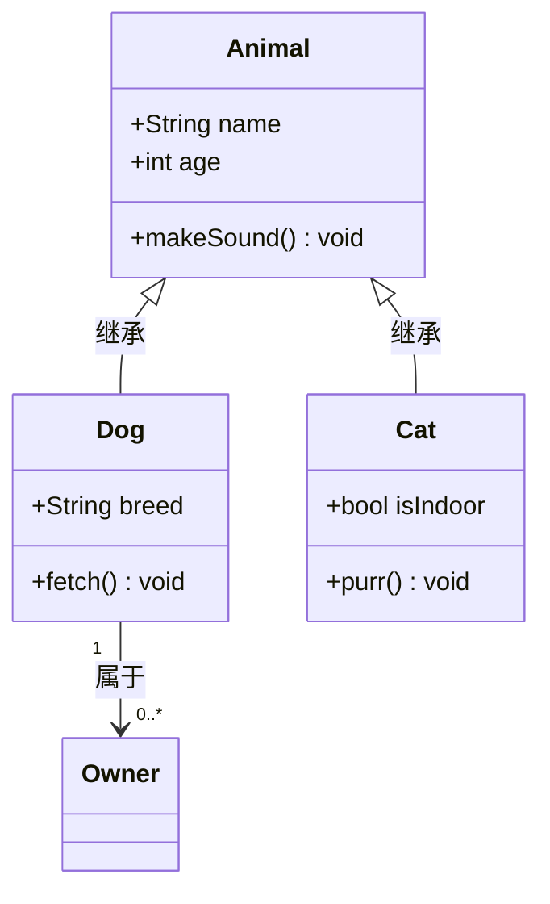
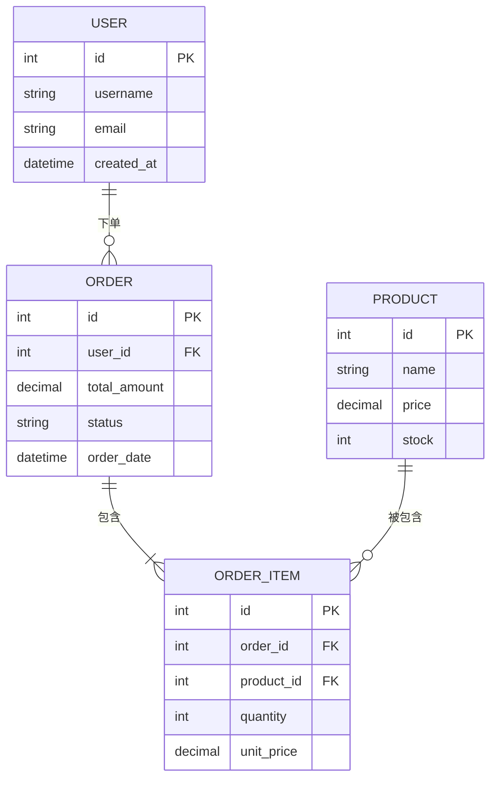
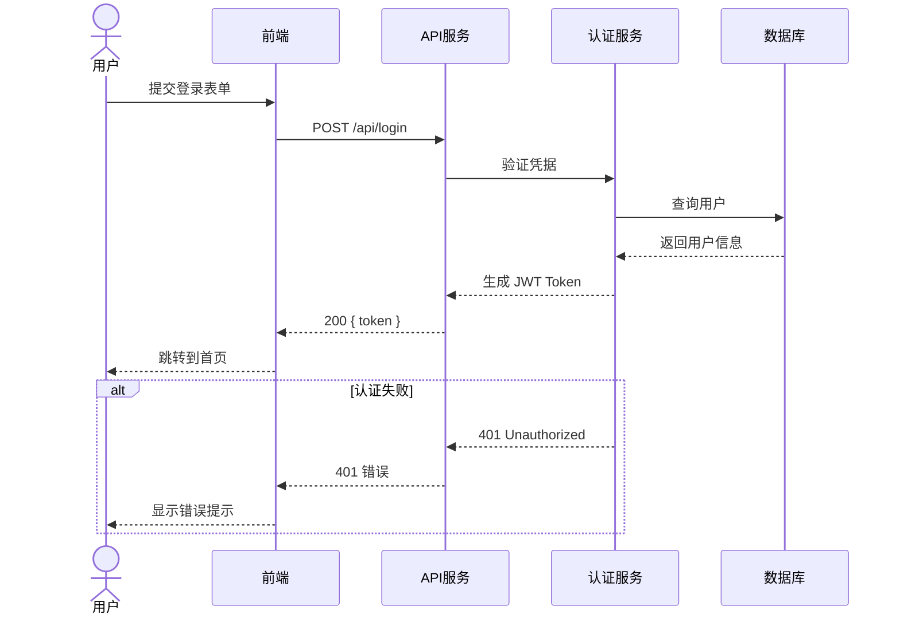
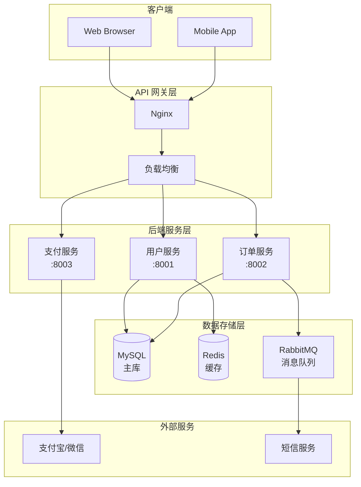
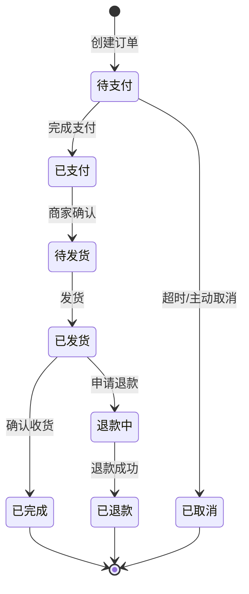
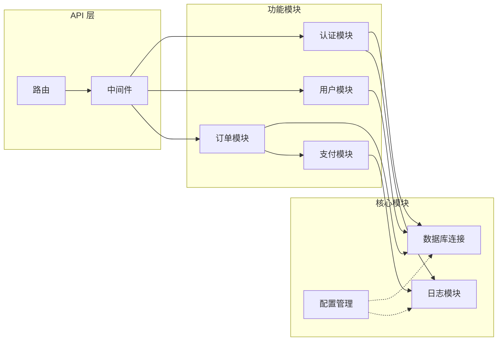
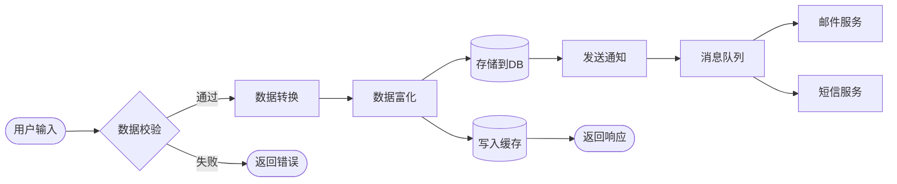
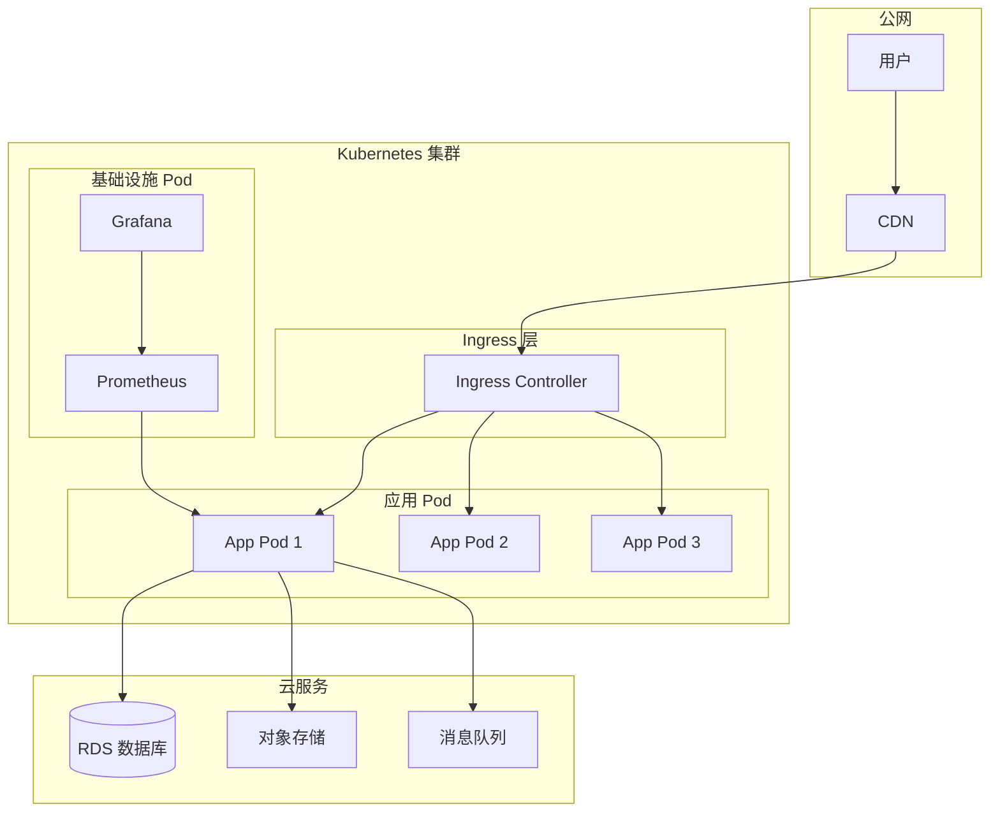

# Mermaid 图表模板参考

## 1. 类图 (classDiagram)

**语法说明**：
- `<|--` 继承
- `*--` 组合（强依赖）
- `o--` 聚合（弱依赖）
- `-->` 关联
- `..>` 依赖
- `+` public, `-` private, `#` protected
- `<<interface>>` / `<<abstract>>` 修饰符

---

## 2. ER 图 (erDiagram)

**关系符号**：
- `||` 精确一个
- `o|` 零或一
- `}|` 一或多
- `}o` 零或多

---

## 3. 序列图 (sequenceDiagram)

**常用语法**：
- `->>` 实线箭头（同步调用）
- `-->>` 虚线箭头（响应/返回）
- `activate` / `deactivate` 激活框
- `alt` / `else` / `end` 条件分支
- `loop` 循环
- `par` 并行
- `Note over A,B:` 注释

---

## 4. 系统架构图 (graph / flowchart)

---

## 5. 状态图 (stateDiagram-v2)

---

## 6. 组件/依赖图 (graph LR)

---

## 7. 数据流图 (flowchart LR)

---

## 8. 部署图 (graph TB)

---

## Mermaid 常见错误与修复

| 错误现象 | 原因 | 修复方式 |
|---------|------|---------|
| 节点ID包含中文/空格 | ID 不合法 | 改为英文 ID，中文放标签里 `A["中文"]` |
| 箭头方向混乱 | 方向词错误 | `TD`=上到下, `LR`=左到右, `RL`=右到左, `BT`=下到上 |
| subgraph 渲染失败 | 缺少 `end` | 每个 `subgraph` 必须有对应 `end` |
| ER 图关系线错误 | 符号不对 | 参考标准符号 `||--o{` |
| 特殊字符导致解析失败 | 括号/引号冲突 | 用 `"..."` 包裹含特殊字符的标签 |
